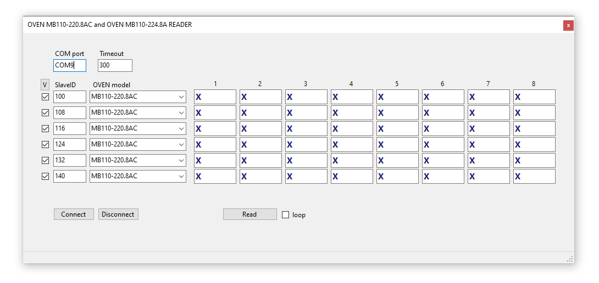

# OVENSensorReader
Reads input registers of OVEN modules: ОВЕН MB110-220.8AC, ОВЕН MB110-224.8A

1. You input COM port
2. Set timeout, 30 by default (need reconnect to aply changes)
3. Press connect
4. Choose OVEN model
5. Set slave ID
6. Checkbox on the left means that this device will be scanned
7. Press Read
8. If device can't be connected, checkbox will be unchecked
9. For constant monitoring check "loop" checkbox

This is one threaded application, UI may be partially blocked during reading.
Application requires NuGets: NModbus, NModbus.Serial, System.IO.Ports.
